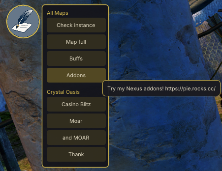
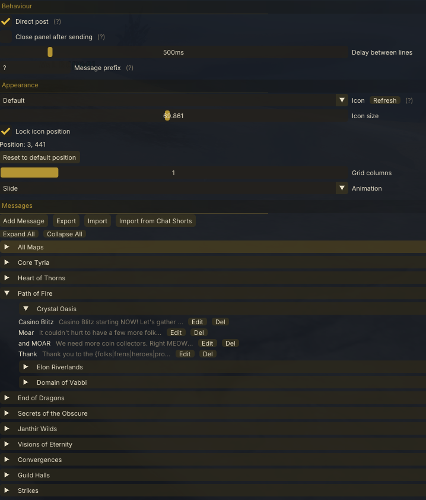

# Say Again

A [Nexus](https://raidcore.gg/Nexus) addon for Guild Wars 2. Save commonly-used chat messages and post them instantly from a floating button panel.

## AI Notice

This addon has been largely created using Claude. I understand that some folks have a moral, financial or political objection to creating software using an LLM. I just wanted to make a useful tool for the GW2 community, and this was the only way I could do it.

If an LLM creating software upsets you, then perhaps this repo isn't for you. Move on, and enjoy your day.

## Screenshots

## Features

- Post saved messages to any chat channel with one click
- Tag messages to specific maps — they only appear when you're there
- Multi-line messages sent as sequential chat posts
- Random word selection: `You are {amazing|beautiful|wonderful}!`
- Right-click a message button to pick a specific channel before sending
- Floating icon with customisable size, position, and animation style
- Pin the panel open or close it automatically after each send
- Import messages from Chat Shorts, or export/import your own JSON backups
- Drag and drop to reorder messages in the settings panel

## Installation

1. Download `SayAgain.dll` from the [releases page](../../releases)
2. Place it in your Nexus addons folder
